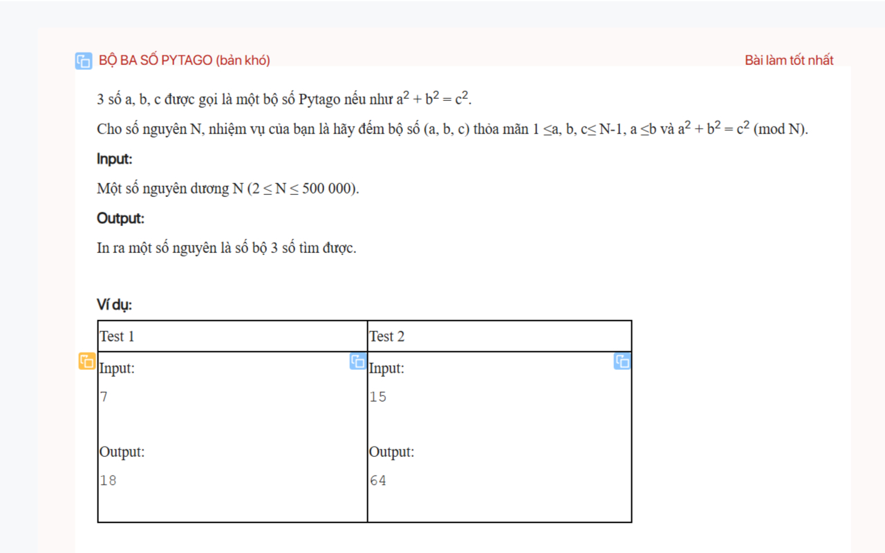
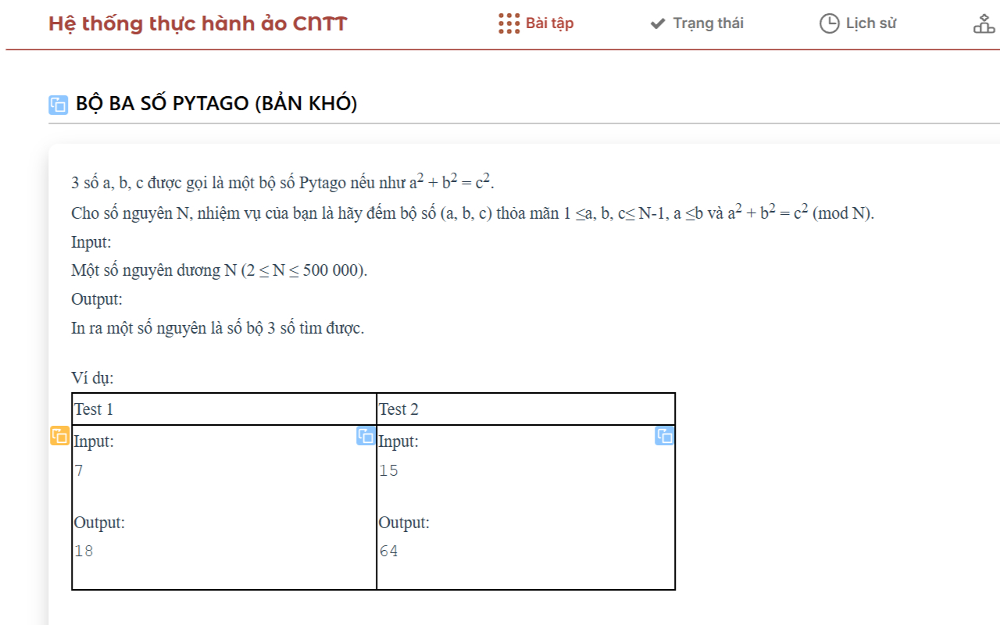

# CodePTIT Copier

Xóa dòng trống thừa và copy nhanh Testcase, Mã bài + Tên bài được chuẩn hóa trên CodePTIT

## TÍNH NĂNG:

- Sửa lỗi dòng trống thừa và Tạo nút copy nhanh Testcase trên CodePTIT (trang cũ lẫn beta)
- Copy nhanh Mã bài_Tên bài được chuẩn hóa để đặt tên cho file
  - Ví dụ sao chép: `PYKT13017_BoBaSoPytagoBanKho.cpp` cho bài `BỘ BA SỐ PYTAGO (bản khó)`
- Hỗ trợ copy và paste nhanh input, output cùng lúc vào CPH (dùng cùng [KeyClipboard](https://github.com/nvbangg/KeyClipboard))

## CÁCH CÀI ĐẶT:

- Cài extension tại Chrome store: [CodePTIT_Copier](https://chromewebstore.google.com/detail/codeptit-copier/ncckkgpgiplcmbmobjlffkbaaklohhbo)

- Hoặc cài bằng user script tại [Greasyfork](https://greasyfork.org/vi/scripts/536045-codeptit-copier) hoặc tại [Openuserjs](https://openuserjs.org/scripts/nvbangg/CodePTIT_Copier)

##  

